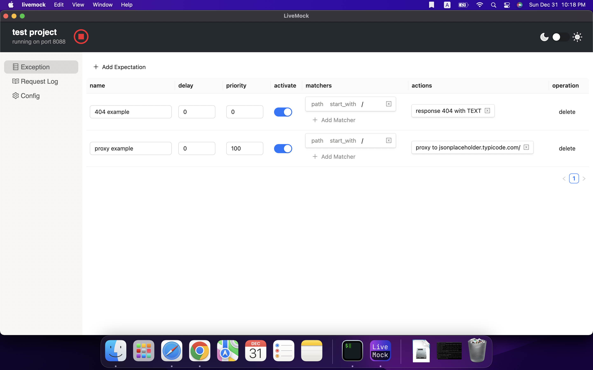

# 🚀 Getting Started

LiveMock is an api mock tool, offering mock data, request proxying, and logging, to streamline workflows and track traffic.

# ✨ Features

- **Dynamic mocking** - Apply mock changes without restarting the server
- **Cross-platform** - Available as web, Windows, and Mac applications
- **api proxy support** Forward requests to actual API when needed
- **support mockjs** - Generate mock data with mockjs library
- **Logging and analytics** - Log requests/responses for analysis.
